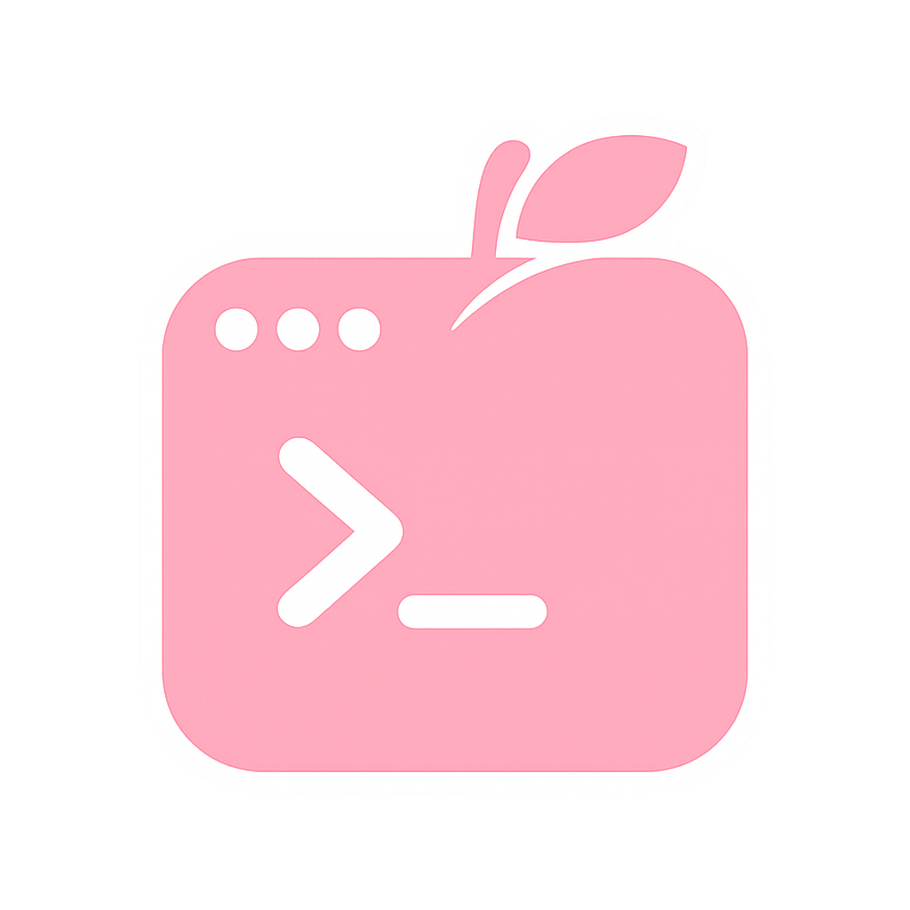

<p style="text-align: left;">
  
</p>

# MomoShell

A cross-platform GUI terminal for Windows, macOS, and Linux that brings local
and SSH shell work into a single app. The goal is to make everyday shell tasks —
saving hosts, connecting, transferring files, reusing commands — doable with
clicks and drag-and-drop, without living in the command line.

Built with [Wails v2](https://wails.io) (Go backend + React frontend).

## ✨ Features

- **Local & SSH sessions** — Local shells (ConPTY on Windows, PTY on Unix) and
  SSH connections share one session model, rendered by [xterm.js](https://xtermjs.org)
  with WebGL acceleration and full-screen app support (vim, htop, …).
- **Host manager** — Save hosts with name, address, labels, and username.
  Authenticate by password, SSH key, or agent. Credentials are kept in the OS
  keychain, falling back to an AES-GCM encrypted file — never in plaintext.
- **Multi-tab & split panes** — Open many hosts at once and split a tab
  horizontally or vertically via drag-and-drop.
- **GUI file transfer** — A dual-pane SFTP browser for upload/download, plus
  ZMODEM (`rz`/`sz`): drop files onto a connected shell to send them.
- **Command history** — Recorded per host; click any entry to copy it to the
  clipboard or send it to the focused terminal.
- **LAN host sharing** — Discover peers on the same network over mDNS, pair with
  a PIN, and share saved host metadata (never credentials).
- **Security by default** — Host key fingerprint verification on first connect
  (TOFU), and credentials that never leave the machine.
- **Theming & i18n** — Light/dark themes with accent colors, and UI in Korean,
  English, Chinese, and Japanese (follows the system language by default).

## 🛠️ Tech Stack

| Layer            | Choice                                                              |
| ---------------- | ------------------------------------------------------------------- |
| App framework    | Wails v2 (Go + WebView)                                             |
| Backend          | Go 1.25, Hexagonal (Ports & Adapters) architecture under `internal/`|
| Frontend         | React 18 + TypeScript + Vite, Feature-Sliced Design                 |
| Styling / state  | Tailwind CSS v4, zustand, i18next                                   |
| Terminal         | xterm.js (fit / webgl / search / web-links / unicode11 addons)      |
| Persistence      | SQLite (`modernc.org/sqlite`, CGO-free) for hosts, history, settings|
| Credentials      | OS keychain (`zalando/go-keyring`) with encrypted-file fallback     |

## 🚀 Getting Started

### Prerequisites

- [Go](https://go.dev/dl/) 1.25+
- [Node.js](https://nodejs.org) 18+
- [Wails CLI](https://wails.io/docs/gettingstarted/installation) v2:
  ```sh
  go install github.com/wailsapp/wails/v2/cmd/wails@latest
  ```
- Platform WebView runtime (WebView2 on Windows; WebKit `libgtk`/`libwebkit` on
  Linux). Run `wails doctor` to check your environment.

### Development

Run with hot-reload for both Go and frontend changes:

```sh
wails dev
```

### Build

Produce a redistributable, production binary in `build/bin`:

```sh
wails build
```

### Tests

```sh
go test ./...              # backend
cd frontend && npm test    # frontend
```

## 📄 License

Released under the [MIT License](LICENSE). Copyright © 2026 Starpia.
